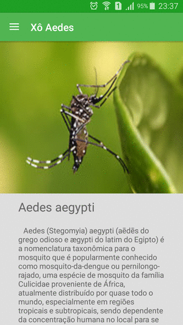

#Xô Aedes
##Visão Geral

##Descrição:
 Esse aplicativo tem como objetivo principal informar e ensinar aos usuários, o que são as doenças transmitidas pelo aedes aegypti, como prevenir e quais são os sintomas.

##Descrição técnica:
 * O app foi construído usando um Navigation Drawer layout.
 * Com uma MainAcitivy usando 5 fragment layouts e outra Intent.
 * Ao deslizar para a direita o usuário terá um Navigation Drawer Layout com
 * 5 itens de menu cada um ao ser clicado irá mostrar um fragment diferente.
 * Cada fragment tem informações para que o usuário aprenda a lidar contra o mosquito.
 * Também terá outra Intent informando a versão e o motivo da construção do aplicativo,
 * E ainda ter um item de Menu no qual o usuário poderá enviar e-mail com um pequeno resumo e mais informações sobre o mosquito e suas doenças.
 
##Idiomas Disponíveis:
 * Português 
 * Inglês

##Requisitos Utilizados:
###ViewGroups Utilizados:
 * LinearLayout
 * RelativeLayout
 * FrameLayout
 * CoordinatorLayout
 
###Interações:
 * Swipe
 * Click em item de menu
 
###Utilização de Intent e Variáveis:

 * O aplicativo utilizar dois Intents e 5 fragments 
 * Utiliza-se variáveis
 
###Utilização de Imagens:
 * Todos os fragments tem imagens, além do ícone modificado do app e também ícones do
material design no Navigation Drawer.
